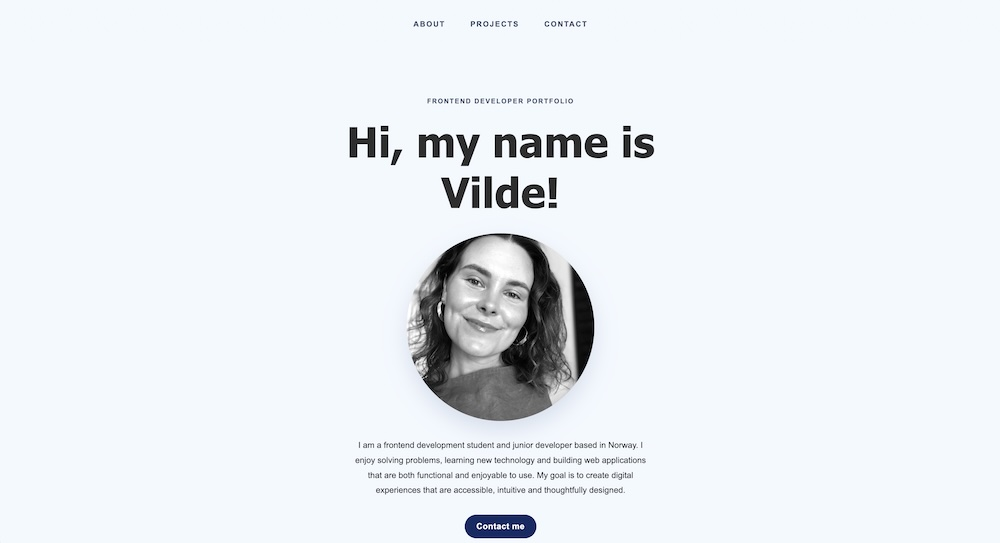

# Portfolio 2

## _Personal Portfolio_



## :books: Description

This portfolio was developed as part of the **Portfolio 2 Course Assignment at Noroff**.

The goal of this project was to document previous coursework, create a professional GitHub profile, and build a personal portfolio website showcasing selected frontend development projects.

The portfolio serves as a central hub for presenting my work and demonstrating the skills I have developed throughout my frontend development studies.

### :sparkles: Features

- Responsive design
- About section
- Project showcase
- Contact section
- GitHub repository links
- Live project links
- Mobile-friendly navigation

<br><br>

## :rocket: Live Version

[Portfolio Website](https://VildeAvloes.github.io/portfolio-2)

<br><br>

## :computer: Projects Included

The portfolio showcases the following projects:

- Semester Project 2
- JavaScript Frameworks Course Assignment
- Project Exam 2 – Holidaze

Each project includes:

- Project description
- Screenshot
- GitHub repository link
- Live site link

<br><br>

## :construction_worker: Getting Started

Before you begin, make sure you have the following installed:

- [Node.js](https://nodejs.org/)
- A terminal
- Your preferred code editor

### Clone the Repository

```bash
git clone git@github.com:VildeAvloes/portfolio-2.git
```

### Navigate to project folder

```bash
cd portfolio-2
```

### Install dependencies

```bash
npm install
```

## Usage

When installed you can use the following commands to run the application.

**Start:** Launches the application in development mode.

```bash
npm start
```

**Build:** Builds the application for production.

```bash
npm run build
```

**Format:** Formats files using Prettier.

```bash
npm run format
```

<br><br>

## Deployment

This project is deployed using GitHub Pages.

To deploy the latest build, run:

```bash
npm run deploy
```

<br><br>

## :wrench: Technologies Used

- React
- JavaScript
- Sass
- GitHub Pages

<br><br>

## :art: Design & Planning

The portfolio was designed with a focus on:

- Responsive design
- Accessibility
- Clean and modern UI
- Consistent visual hierarchy
- User-friendly navigation

<br><br>

## :page_facing_up: License

This project is open for educational use as part of Noroff's Portfolio 2 Assignment. Please contact me before reusing the code for anything outside of that.

<br><br>

## :envelope: Contact

- [My GitHub Profile](https://github.com/VildeAvloes)
- [My LinkedIn Page](https://www.linkedin.com/in/vildeavloes/)
